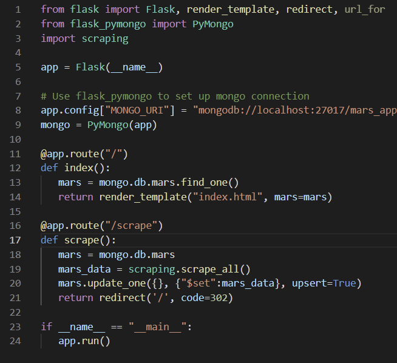
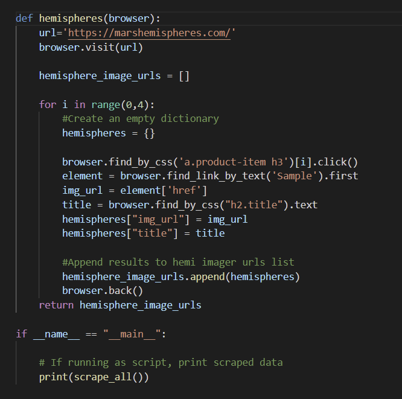
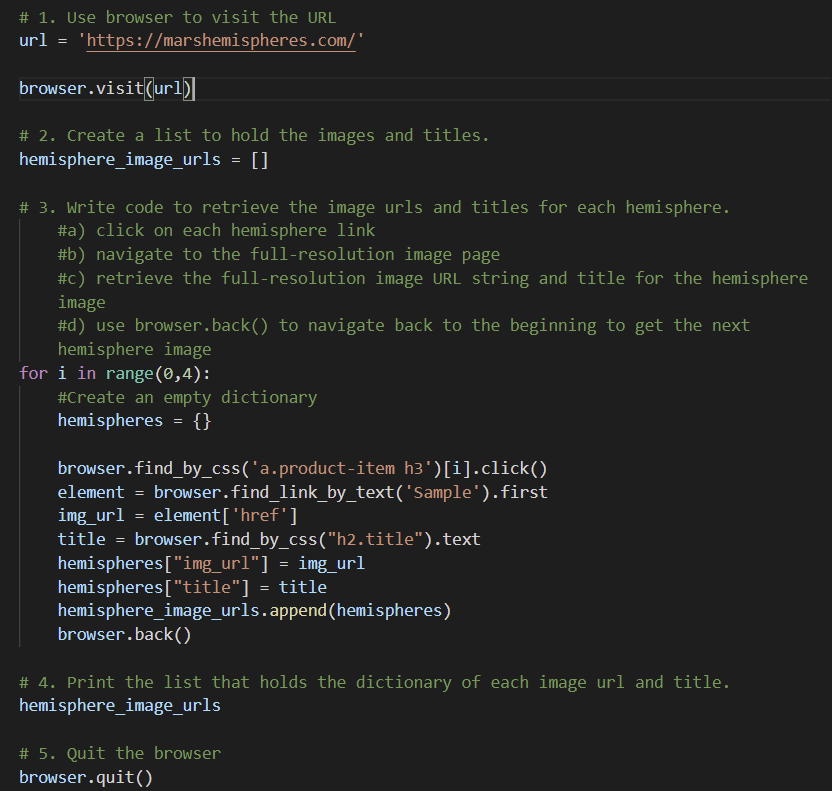
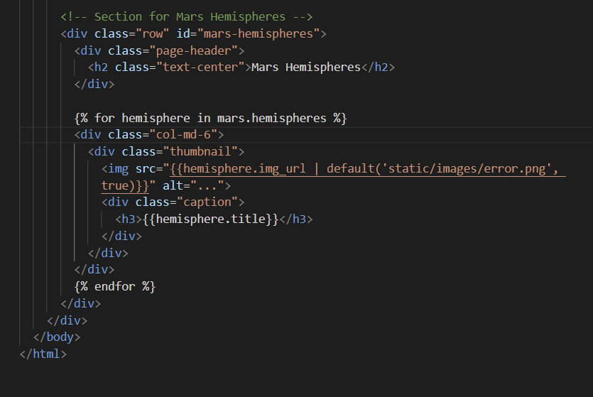
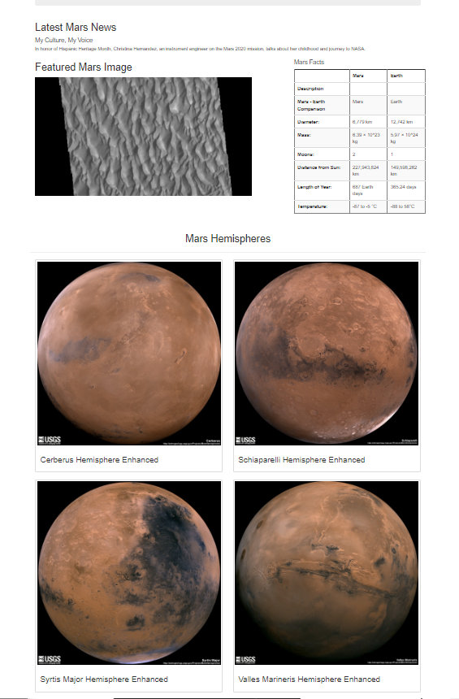

# Mission-to-Mars

Project Overview: 

 - Using BeautifulSoup and Splinter, scrape full-resolution images of Mars’s hemispheres and the image titles.

 - Store the scraped data on a Mongo database and update the web application to display the data

 - Alter the design of the web app to accommodate the changes using Bootstrap 3 components

# Images

